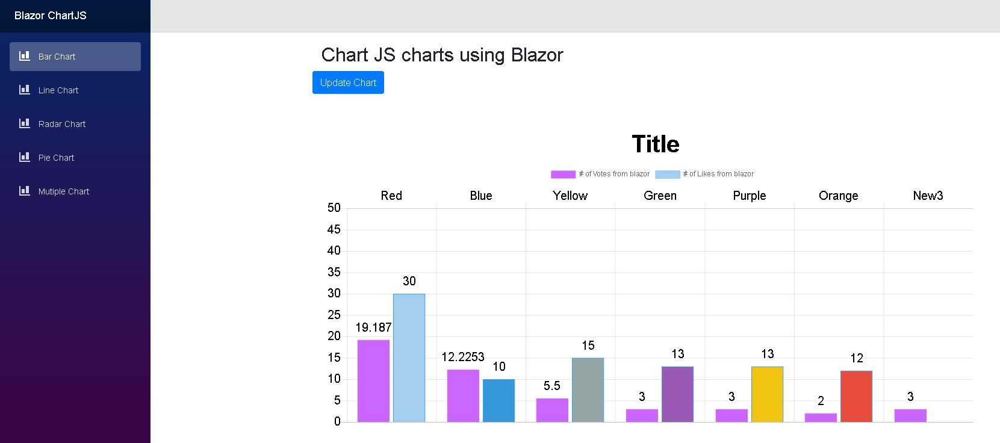

## Simple Components for Blazor Projects

```
Note: Just as Blazor, this repo is also experimental.
```

If you like the idea of this repo leave your feedback as an issue or star the repo or let me know on [@ma_khan](https://twitter.com/ma_khan)

Currently, starting with a simple [ChartJS](https://github.com/chartjs/Chart.js) implementation. 


## Prerequisites

Don't know what Blazor is? Read [here](https://github.com/aspnet/Blazor)

Complete all Blazor dependencies.

1. Visual Studio 2017 (15.8 or later)
2. DotNetCore 2.1 (2.1.402 or later).


## Installation 

 


To Install 

```
Install-Package BlazorComponents
```
or 
```
dotnet add package BlazorComponents
```

## Usage

1. In cshtml file add this:

```html
<div class="row">
    <button class="btn btn-primary" onclick="@UpdateChart">Update Chart </button>
</div>
<ChartJsBarChart ref="barChartJs" Chart="@blazorBarChartJS" Width="600" Height="300" />
```

```csharp
@functions {

    public ChartJSBarChart blazorBarChartJS { get; set; } = new ChartJSBarChart();
    ChartJsBarChart barChartJs;

    protected override void OnInit()
    {

        blazorBarChartJS = new ChartJSBarChart()
        {
            ChartType = "bar",
            CanvasId = "myFirstBarChart",
            Options = new ChartJsOptions()
            {
                Text = "Sample chart from Blazor",
                BorderWidth = 1,
                Display = true,
				Title = new ChartJsTitle()
                {
                    Display = true,
                    Text = data.Title,
                    FontSize = 40
                },
				Layout = new ChartJsLayout()
                {
                    Padding = new ChartJsPadding()
                    {
                        Bottom = 0,
                        Left = 0,
                        Right = 0,
                        Top = 50
                    }
                },
				Legend = new ChartJsLegend()
                {
                    Position = "top",
                    Display = false
                },
				Scales = new ChartJsScale()
				{
					XAxes = new List<ChartJsXAxes>()
                    {
                        new ChartJsXAxes()
                        {
                            Ticks = new ChartJsTicks()
                            {
                                BeginAtZero = true,
                                FontSize = 20                                    
                            },
                            Position = "top"
                        }
                    },
					YAxes = new List<ChartJsYAxes>()
                    {
                        new ChartJsYAxes()
                        {
                            Ticks = new ChartJsTicks()
                            {
                                BeginAtZero = true,
                                FontSize = 20,
                                Max = data.MaximumYValue
                            }
                        }
                    }
				},
				Plugins = new ChartJsPlugins()
                {                    
                    Datalabels = new ChartJsDataLabels()
                    {
                        Align = "start",
                        Anchor = "end",
                        Color = "black",
                        Display = true,
                        Font = new ChartJsDataLabelsFont()
                        {
                            Size = 20
                        }
                    }
                }
            },
            Data = new ChartJsBarData()
            {
                Labels = new List<string>() { "Red", "Blue", "Yellow", "Green", "Purple", "Orange" },
                Datasets = new List<ChartJsBarDataset>()
                {
                    new ChartJsBarDataset()
                    {
                        Label = "# of Votes from blazor",
                        BackgroundColor = new List<string>(){"#cc65fe" },
                        BorderColor = "#cc65fe",
                        PointHoverRadius = 2,
                        Data = new List<double>(){ 19.187,12.2253,5.5,3,3,2}
                    },
                    new ChartJsBarDataset()
                    {
                        Label = "# of Likes from blazor",
                        BackgroundColor = new List<string>() {
                            "#a4cef0",
                            "#3498db",
                            "#95a5a6",
                            "#9b59b6",
                            "#f1c40f",
                            "#e74c3c",
                            "#34495e" },
                        BorderColor = "#36a2eb",
                        PointHoverRadius = 2,
                        Data = new List<int>(){ 30,10,15,13,13,12}.Select<int,double>(i=> i).ToList()
                    }
                }
            }
        };
    }

    public async Task<bool> UpdateChart()
    {
        //Update existing dataset
        blazorBarChartJS.Data.Labels.Add($"New{DateTime.Now.Second}");
        var firstDataSet = blazorBarChartJS.Data.Datasets[0];
        firstDataSet.Data.Add(DateTime.Now.Second);
        
        //Add new dataset
        //blazorLineChartJS.Data.Datasets.Add(new ChartJsLineDataset()
        //{
        //    BackgroundColor = "#cc65fe",
        //    BorderColor = "#cc65fe",
        //    Label = "# of Votes from blazor 1",
        //    Data = new List<int> {20,21,12,3,4,4},
        //    Fill = true,
        //    BorderWidth = 2,
        //    PointRadius = 3,
        //    PointBorderWidth = 1
        //});

        return true;
    }
}
```

2. In index.html add:

```html
    <script src="//cdnjs.cloudflare.com/ajax/libs/Chart.js/2.7.2/Chart.min.js"></script>
    <script type="blazor-boot">
    </script>
```

2.1. For using the data label plugin add this, too:

``` html
	<script src="//cdn.jsdelivr.net/npm/chartjs-plugin-datalabels"></script>
```

3. In _ViewImports.cshtml add:

```html
    @using BlazorComponents.ChartJS
    @using BlazorComponents.Shared
    @addTagHelper *,BlazorComponents
```

## Sample Output

Bar Chart Example:



